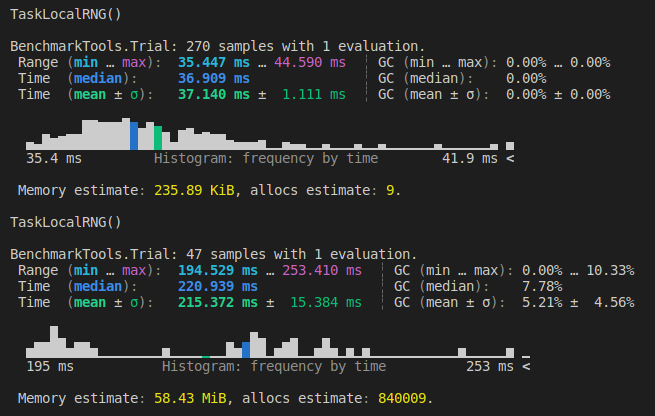

# Null Distribution Generation
This repositroy contains some functions to generate a Null-distribution for two parallel streams of events through shifting. This approach keeps temporal correlation intact.

 

`ShiftSimulation` outperforms the "old" function by bypassing overhead. Depending on the length and distribution of the input data the advantage can vary. In this case with 10000 Simulations it performs ca. 5.5 times faster (minimal code run time) and gives the same output.

